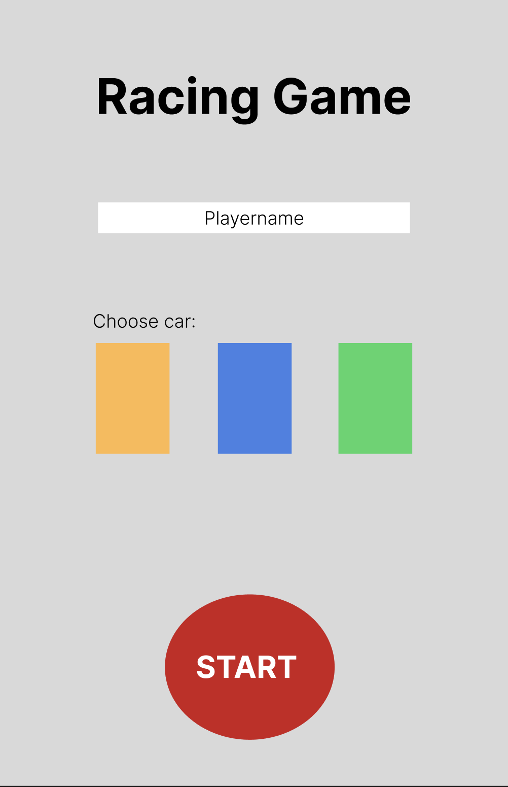
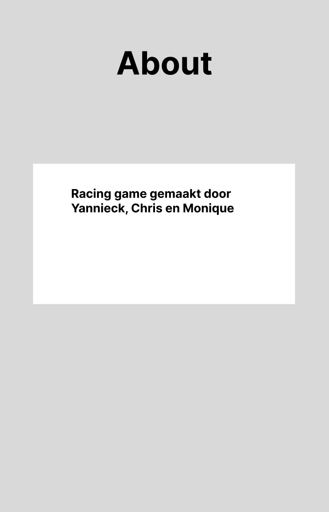
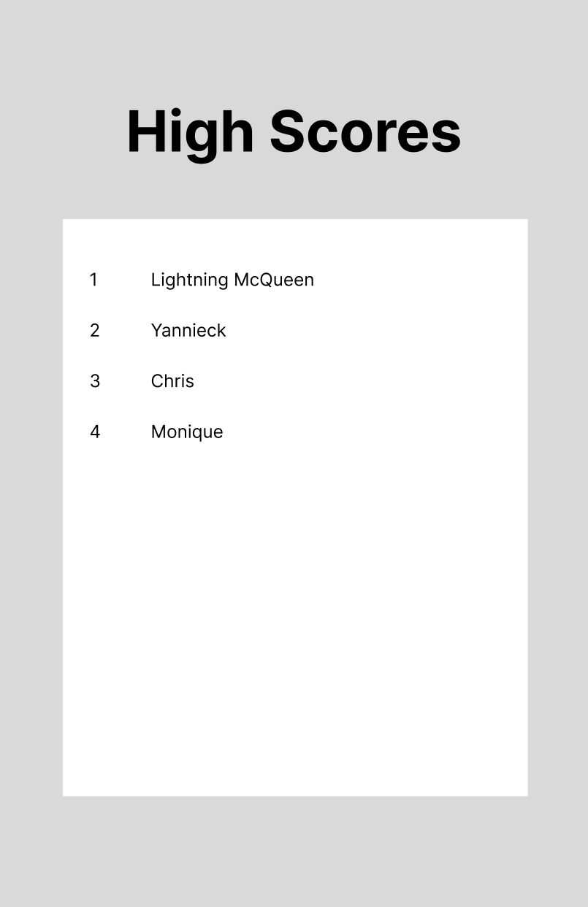
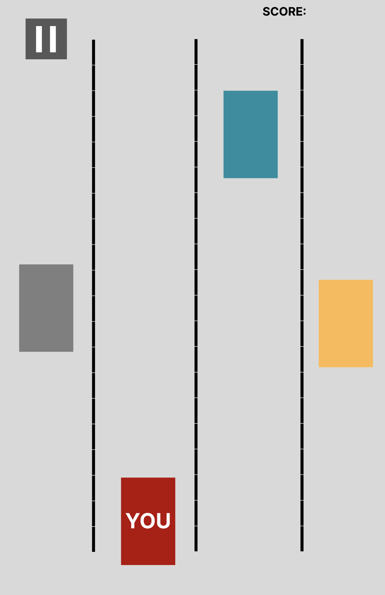
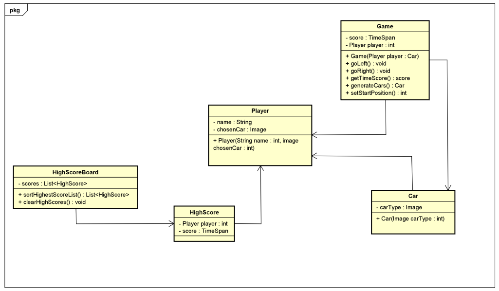
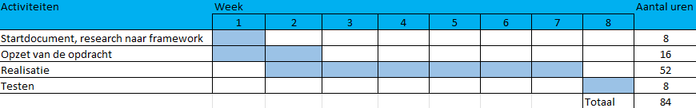

# Startdocument C#2 project - racing game

Startdocument van **Monique Sabong**, **Yannieck Blaauw** en **Chris Klunder**.

## Applicatie Beschrijving

Voor dit project willen wij een race game maken. Het is een single player game, waarbij je een auto kan besturen van links naar rechts.
Er komen 4 of meerdere wegen naast elkaar waarbij andere auto's oprijden die je moet ontwijken. Het doel van dit spel is om zo ver mogelijk auto's te ontwijken zonder
een auto aan te rijden of een ander obstakel. Voor dit spel komt er minstens 4 schermen, namelijk de startmenu, de game zelf, een highscore board met de beste tijd en een about pagina.

### Input & Output

In deze sectie worden de input en output van de applicatie beschreven.

#### Input

In de tabellen hieronder worden alle input beschreven. (De input dat de user moet invoeren om de applicatie werkend te krijgen)

| Case                                                           | Type          | Conditions |
| -------------------------------------------------------------- | ------------- | ---------- |
| Naam speler                                                    | `String`      | not empty  |
| Type auto                                                      | `Image`       | not empty  |
| De keybinds om de auto naar links of naar rechts te laten gaan | `KeyBoardKey` |

#### Output

| Case                                                | Type       |
| --------------------------------------------------- | ---------- |
| De highscore van de speler                          | `TimeSpan` |
| De images van de auto's op de weg                   | `image`    |
| De gekozen auto van de speler op de weg             | `image`    |
| De positie van de speler op de weg                  | `float`    |
| De positie van de overige auto's op de weg          | `float`    |
| De score aan het einde van de game (tijd: HH:MM:SS) | `TimeSpan` |

#### Berekeningen

| Case                                                                  | Calculation                                                                                                                      |
| --------------------------------------------------------------------- | -------------------------------------------------------------------------------------------------------------------------------- |
| De tijd score van de speler                                           | TimeSpan                                                                                                                         |
| De auto van de speler naar links of recht laten gaan                  | huidige postitie plus of min de hoeveelheid dat je naar links of recht gaat                                                      |
| Berekenen of de speler een auto heeft geraakt                         | Checken of de auto van de speler bijna of dezelfde x/y waarde heeft als de auto waar je tegenaan kan botsen                      |
| De auto op de weg houden. Niet dat je de auto buiten het scherm komt. | Als de auto van de speler niet kleiner dan of groter dan een bepaalde x waarde komt, dan kan je niet verder naar links of rechts |

#### Opmerkingen

-   Input wordt gevalideerd
-   Alleen de Main klasse zal `System.out.println` bevatten
-   Unit Tests worden meegeleverd

## Lay-out

Startmenu van de game

About pagina

Highscore pagina

De game zelf

## Klassendiagram

## Testplan

In this section the testcases will be described to test the application.

### Testdata

In de tabellen hieronder worden de data weergegeven die nodig zijn om de applicatie te testen.

#### Player

| ID                  | Input       | Code                              |
| ------------------- | ----------- | --------------------------------- |
| `Lightning McQueen` | name: Chris | `new Player("Lightning McQueen")` |

#### Car

| ID           | Input          | Code                |
| ------------ | -------------- | ------------------- |
| `rodeAuto`   | rodeAuto.png   | `new Car(image[0])` |
| `blauweAuto` | blauweAuto.png | `new Car(image[1])` |
| `geleAuto`   | geleAuto.png   | `new Car(image[2])` |
| `oranjeAuto` | oranjeAuto.png | `new Car(image[3])` |

#### Game

| ID         | Input          | Code                                 |
| ---------- | -------------- | ------------------------------------ |
| `raceGame` | name: raceGame | `new Game(Player lightning McQueen)` |

### Testcases

In dit hoofdstuk worden de testcases beschreven. Elke testcase dient uitgevoerd te worden met de testdata als uitgangspunt.

#### #1 Testen of de auto gebotst heeft met een andere auto

Bij deze test wordt gecontroleerd of de auto in botsing is gekomen met een andere auto. Wanneer dit gebeurt, zou het spel afgelopen moeten zijn.

| Step | Input      | Action                     | Expected output  |
| ---- | ---------- | -------------------------- | ---------------- |
| 1    | naam       | maak een nieuwe speler aan |                  |
| 2    | afbeelding | maak een nieuwe auto aan   |                  |
| 3    |            | verplaats speler naar auto | Game over scherm |

#### #2 Testen of the speler een nieuwe highscore heeft behaald

Deze test controleert of de speler een nieuwe highscore heeft behaald. Wanneer dit gebeurt, moet de score worden toegevoegd aan het highscore-menu.

#### #3 Testen of de speler de bewegings controls indrukt

Deze test controleert of de speler de bewegings controls indrukt. Wanneer dit gebeurt, moet de speler naar links of rechts bewegen, afhankelijk van de ingedrukte toets.

| Step | Input      | Action       | Expected output |
| ---- | ---------- | ------------ | --------------- |
| 1    | `Monique1` | `isSenior()` | FALSE           |
| 2    | `Henry1`   | `isSenior()` | TRUE            |

## Planning

Om de voortgang van dit project te bewaken, is er een planning gemaakt. Deze planning bevat in grote lijnen hetgeen waarmee wij ons bezig zullen houden per week tot de deadline. Er kan natuurlijk afgeweken worden van deze planning, maar het is het doel om deze in grote lijnen te volgen.

## Literatuurlijst

-   <https://learn.microsoft.com/en-us/dotnet/maui/what-is-maui?view=net-maui-7.0>
